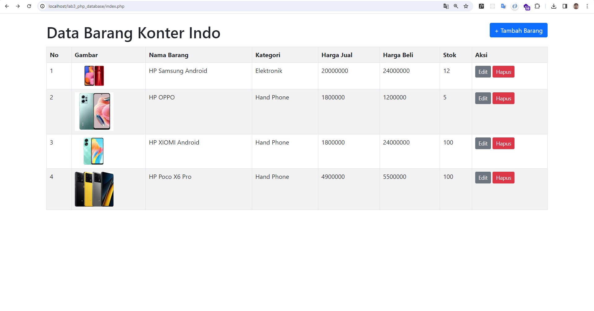
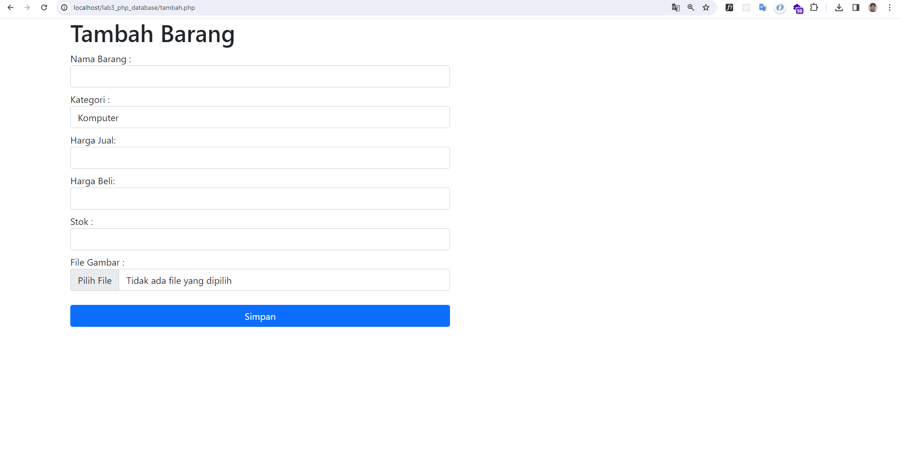
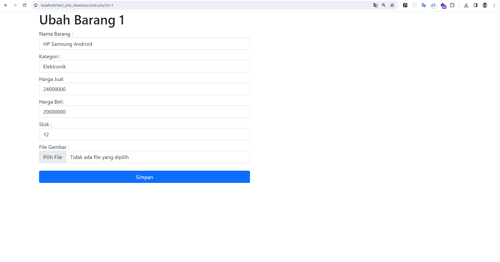

### Membuat CRUD dengan PHP Mysql

Pastikan anda sudah mendownload tools yang dibutuhkan

- xampp
- visual studio code
- web browser (google chrome)


Selanjutnya buka jalankan mysql dan apache pada xampp control panel
Selanjutnya buka phpmyadmin lalu import `data_barang.sql`


Buat folder di dalam htdocs lalu buat kan beberapa file
- koneksi.php
- tambah.php
- index.php
- ubah.php
- hapus.php

dan juga buat folder bernama `gambar` untuk menampung gambar yang akan kita upload

Buka file koneksi.php masukan kode berikut

```
<?php

$host = "localhost";

$host = "localhost";
$user = "root";
$pass = "";
$db = "latihan1";

$conn = mysqli_connect($host, $user, $pass, $db);
if ($conn == false) {
  echo "Koneksi ke server gagal";
  die();
}

```

kode diatas merupakan koneksi pada mysql pastikan untuk user dan password sesuaikan dengan punya kalian

Selanjutnya kita buka file `index.php` lalu masukan kode berikut

```
<?php
include("koneksi.php");

$sql = 'SELECT * FROM data_barang';
$result = mysqli_query($conn, $sql);

?>

<!DOCTYPE html>
<html lang="en">

<head>
  <meta charset="UTF-8">
  <meta name="viewport" content="width=device-width, initial-scale=1.0">
  <link href="https://cdn.jsdelivr.net/npm/bootstrap@5.0.2/dist/css/bootstrap.min.css" rel="stylesheet"
    integrity="sha384-EVSTQN3/azprG1Anm3QDgpJLIm9Nao0Yz1ztcQTwFspd3yD65VohhpuuCOmLASjC" crossorigin="anonymous">
  <title>Data Barang</title>
</head>

<body>
  <div class="container mt-4">
    <div class="d-flex justify-content-between">

      <h1>Data Barang Konter Indo</h1>
      <a href="tambah.php" class="btn btn-primary mb-4">+ Tambah Barang</a>
    </div>
    <div class="main">
      <table class="table table-bordered table-striped">
        <tr>
          <th>No</th>
          <th>Gambar</th>
          <th>Nama Barang</th>
          <th>Kategori</th>
          <th>Harga Jual</th>
          <th>Harga Beli</th>
          <th>Stok</th>
          <th>Aksi</th>
        </tr>
        <?php if ($result) : ?>
        <?php $no = 1; ?>
        <?php while ($row = mysqli_fetch_array($result)) : ?>
        <tr>
          <td><?= $no++ ?></td>
          <td>" alt="<?= $row['nama']; ?>"></td>
          <td><?= $row['nama']; ?></td>
          <td><?= $row['kategori']; ?></td>
          <td><?= $row['harga_beli']; ?></td>
          <td><?= $row['harga_jual']; ?></td>
          <td><?= $row['stok']; ?></td>
          <td><a type="button" class="btn btn-sm btn-secondary mr-2" href="ubah.php?id=<?= $row['id']; ?>">Edit</a>
            <a type="button" class="btn btn-sm btn-danger" href="hapus.php?id=<?= $row['id']; ?>">Hapus</a>
          </td>
        </tr>
        <?php endwhile;
        else : ?>
        <tr>
          <td colspan="7"> Belum ada data</td>
        </tr>
        <?php endif; ?>
      </table>
    </div>
  </div>
  <script>
  function hapus() {
    alert("Anda bukan admin!")
  }

  function edit() {
    alert("Anda bukan admin!")
  }
  </script>
</body>

</html>


```

file diatas merupakan sebuah tampilan data barang yang akan kita munculkan dari database.
didalam terdapat koneksi query untuk memanggil data

- `$sql = 'SELECT * FROM data_barang';`
- `$result = mysqli_query($conn, $sql);`


Selanjutnya kita buka file `tambah.php` lalu masukan kode berikut

```
<?php
error_reporting(E_ALL);
include_once 'koneksi.php';

if (isset($_POST['submit'])) {
  $nama = $_POST['nama'];
  $harga_jual = $_POST['harga_jual'];
  $harga_beli = $_POST['harga_beli'];
  $stok = $_POST['stok'];
  $kategori = $_POST['kategori'];
  $file_gambar = $_FILES['file_gambar'];
  $gambar = null;
  if ($file_gambar['error'] == 0) {
    $filename = str_replace(' ', '_', $file_gambar['name']);
    $destination = dirname(__FILE__) . '/gambar/' . $filename;
    if (move_uploaded_file($file_gambar['tmp_name'], $destination)) {
      $gambar = 'gambar/' . $filename;
    }
  }

  $sql = 'INSERT INTO data_barang (nama, kategori, harga_jual, harga_beli, stok, gambar)';
  $sql .= "VALUE ('{$nama}', '{$kategori}', '{$harga_jual}', '{$harga_beli}', '{$stok}', '{$gambar}')";

  $result = mysqli_query($conn, $sql);
  header('location:index.php');
}
?>

<!DOCTYPE html>
<html lang="en">

<head>
  <meta charset="UTF-8">
  <meta name="viewport" content="width=device-width, initial-scale=1.0">
  <link href="https://cdn.jsdelivr.net/npm/bootstrap@5.0.2/dist/css/bootstrap.min.css" rel="stylesheet"
    integrity="sha384-EVSTQN3/azprG1Anm3QDgpJLIm9Nao0Yz1ztcQTwFspd3yD65VohhpuuCOmLASjC" crossorigin="anonymous">
  <title>Tambah Barang</title>
</head>

<body>
  <div class="container">
    <h1>Tambah Barang</h1>
    <div class="form">
      <form action="tambah.php" method="post" enctype="multipart/form-data">
        <div class="form-group col-md-6">
          <label for="nama">Nama Barang :</label>
          <input type="text" name="nama" id="nama" class="form-control">
        </div>
        <div class="form-group mt-2 col-md-6">
          <label for="kategori">Kategori :</label>
          <select name="kategori" id="kategori" class="form-control ">
            <option value="Komputer">Komputer </option>
            <option value="Elektronik">Elektronik </option>
            <option value="Hand Phone">Hand Phone </option>
          </select>
        </div>
        <div class="form-group mt-2 col-md-6">
          <label for="harga_jual mt-2 ">Harga Jual:</label>
          <input type="text" name="harga_jual" id="harga_jual" class="form-control">
        </div>
        <div class="form-group mt-2 col-md-6">
          <label for="harga_beli">Harga Beli:</label>
          <input type="text" name="harga_beli" id="harga_beli" class="form-control">
        </div>
        <div class="form-group mt-2 col-md-6">
          <label for="stok">Stok :</label>
          <input type="number" name="stok" id="stok" class="form-control">
        </div>
        <div class="form-group mt-2 col-md-6">
          <label for="file_gambar">File Gambar :</label>
          <input type="file" name="file_gambar" id="file_gambar" class="form-control">
        </div>

        <div class="form-group mt-4 col-md-6">
          <input type="submit" name="submit" value="Simpan" id="" class="btn btn-primary w-100">
        </div>
      </form>
    </div>
  </div>
</body>

</html>
```

kode diatas merupakan tampilan untuk menambah data ketika input diisi dengan benar maka data akan dikirim dengan metode post, lalu disimpan ke db setalah berhasil tersimpan, kode meredirect ke halaman utama yaitu index.php

Selanjutnya kita buka file `ubah.php` lalu masukan kode berikut

```
<?php
// error_reporting(E_ALL);
include_once 'koneksi.php';
$id = $_GET['id'];

if (isset($_POST['submit'])) {
  $id_barang = $_POST['id'];
  var_dump($id_barang);
  $nama = $_POST['nama'];
  $harga_jual = $_POST['harga_jual'];
  $harga_beli = $_POST['harga_beli'];
  $stok = $_POST['stok'];
  $kategori = $_POST['kategori'];

  $file_gambar = $_FILES['file_gambar'];
  $gambar = null;
  if ($file_gambar['error'] == 0) {
    $filename = str_replace(' ', '_', $file_gambar['name']);
    $destination = dirname(__FILE__) . '/gambar/' . $filename;
    if (move_uploaded_file($file_gambar['tmp_name'], $destination)) {
      $gambar = 'gambar/' . $filename;
    }
  }

  $sql = 'UPDATE data_barang SET ';
  $sql .= "nama = '{$nama}', kategori = '{$kategori}', ";
  $sql .= "harga_jual = '{$harga_jual}', harga_beli = '{$harga_beli}', stok = '{$stok}' ";
  if (!empty($gambar))
    $sql .= ", gambar = '{$gambar}' ";
  $sql .= "WHERE id='{$id_barang}' ";
  $result = mysqli_query($conn, $sql);
  header('location: index.php');


  // $result = mysqli_query($conn, $sql);
  // header('location: index.php');
}

$sql = "SELECT * FROM data_barang WHERE id='{$id}' ";
$result = mysqli_query($conn, $sql);
if (!$result) die("Error : Data tidak tersedia");
$data = mysqli_fetch_array($result);

function is_select($var, $val)
{
  if ($var == $val) return 'selected="selected"';
  return false;
}
?>

<!DOCTYPE html>
<html lang="en">

<head>
  <meta charset="UTF-8">
  <meta name="viewport" content="width=device-width, initial-scale=1.0">
  <link href="https://cdn.jsdelivr.net/npm/bootstrap@5.0.2/dist/css/bootstrap.min.css" rel="stylesheet"
    integrity="sha384-EVSTQN3/azprG1Anm3QDgpJLIm9Nao0Yz1ztcQTwFspd3yD65VohhpuuCOmLASjC" crossorigin="anonymous">
  <title>Ubah Barang</title>
</head>

<body>
  <div class="container">
    <h1>Ubah Barang <?= $_GET['id'] ?></h1>
    <div class="form">
      <form action="" method="post" enctype="multipart/form-data">
        <div class="form-group col-md-6">
          <label for="nama">Nama Barang :</label>
          <input type="text" name="nama" id="nama" value="<?= $data['nama'] ?>" class="form-control">
        </div>
        <div class="form-group mt-2 col-md-6">
          <label for="kategori">Kategori :</label>
          <select name="kategori" id="kategori" class="form-control ">
            <option value="Komputer" <?php echo is_select("Komputer", $data["kategori"]); ?>>Komputer </option>
            <option <?php echo is_select("Elektronik", $data["kategori"]); ?> value="Elektronik">Elektronik </option>
            <option <?php echo is_select("Hand Phone", $data["kategori"]); ?> value="Hand Phone">Hand Phone </option>
          </select>
        </div>
        <div class="form-group mt-2 col-md-6">
          <label for="harga_jual mt-2 ">Harga Jual:</label>
          <input type="text" name="harga_jual" value="<?= $data['harga_jual'] ?>" id="harga_jual" class="form-control">
        </div>
        <div class="form-group mt-2 col-md-6">
          <label for="harga_beli">Harga Beli:</label>
          <input type="text" value="<?= $data['harga_beli'] ?>" name="harga_beli" id="harga_beli" class="form-control">
        </div>
        <div class="form-group mt-2 col-md-6">
          <label for="stok">Stok :</label>
          <input type="number" value="<?= $data['stok'] ?>" name="stok" id="stok" class="form-control">
        </div>
        <div class="form-group mt-2 col-md-6">
          <label for="file_gambar">File Gambar :</label>
          <input type="file" name="file_gambar" id="file_gambar" class="form-control">
        </div>
        <input type="hidden" value="<?= $data['id'] ?>" name="id">
        <div class="form-group mt-4 col-md-6">
          <input type="submit" name="submit" value="Simpan" id="" class="btn btn-primary w-100">
        </div>
      </form>
    </div>
  </div>
</body>

</html>

```
kode diatas merupakan tampilan ubah data, ketika kita ingin merubah sebuah data yang salah ketik ataupun penambahan stok dll, jika berhasil merubah file akan redirect ke `index.php`


Selanjutnya kita buka file `hapus.php` lalu masukan kode berikut
```
<?php
include_once 'koneksi.php';
$id = $_GET['id'];

$sql = "DELETE FROM data_barang WHERE id = '{$id}'";
$result = mysqli_query($conn, $sql);
header('location: index.php');
```

pada kode diatas merupakan perintah untuk menghapus data, berdasarkan id yang dipilih untuk dihapus
jika berhasil file akan meredirect ke `index.php`

Berikut hasil dari CRUD yang sudah kita buat :

`halaman index`



`halaman tambah`




`halaman ubah`



selesai

Terima kasih semoga bermanfaat
